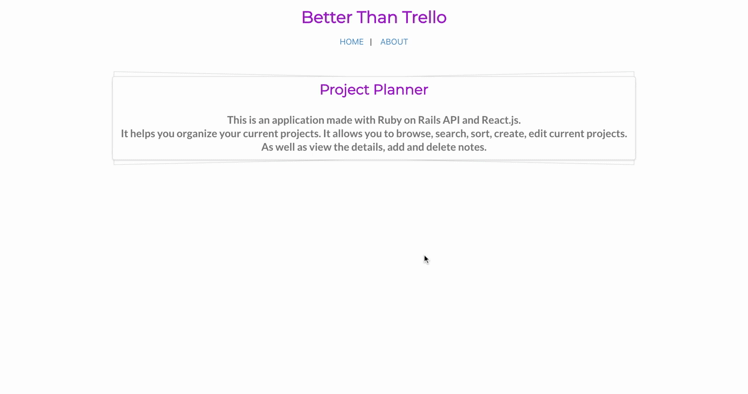
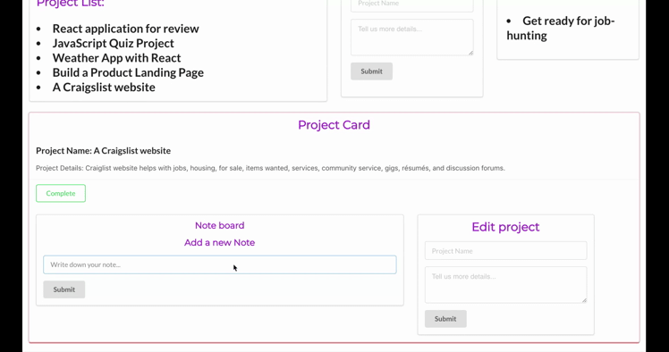
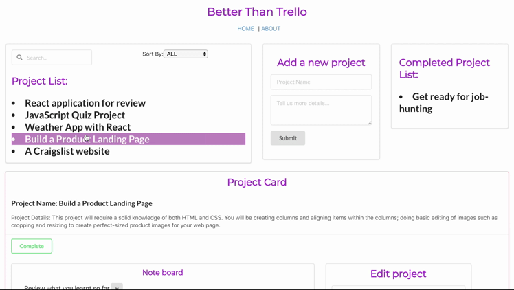

## Project Planner

## About
It is a project management tool that allows you to track your current projects. It allows you to browse, search, sort, create, edit current projects. As well as view the details, add and delete notes.

## Technologies

* Frontend: React
* Backend: Ruby on Rails, PostgreSQL
* Technologies

## Features

* 
* In order to better identify a particular project the user can browse, search, sort

## Future Features

# Project Planner

It is a project management tool that allows you to track your current projects. It allows you to browse, search, sort, create, edit current projects. As well as view the details, add and delete notes.

Testing
## Gif Demo
###### Browse. Search. Sort. View.

###### Add and delete notes.

###### Move completed projects to the done list.

## Tech/framework used

This is an application made with Ruby on Rails API for backend and React for frontend.

###### Built with
- React
- React-router-dom
- Semantic UI CDN
- CSS

## Installation
Use `npm install && npm start` to run the application.

## Credits
This is a group project that made by me and my partner Brian Wong when I was in Flatiron school, so many thanks to the instructors, coaches and my partner in the program!

## Backend Repo
Check out the [Backend Repo](https://github.com/yukiyao119/project-planner-backend)

